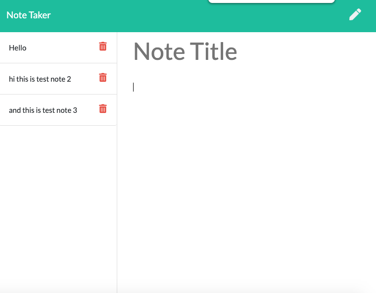
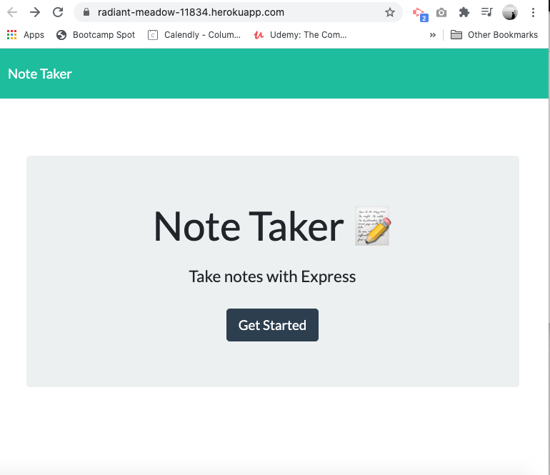

# Note Taker App

## Table of Contents
  
* [Description](#description)
* [Installation](#installation)
* [Usage](#usage)
* [Contributing](#contributing)
* [Tests](#tests)
* [Questions](#questions)
* [License](#license)
  
## Description 
  
A professional note taker app. The back-end has been built with Express and Node, which provides functionality to the front-end HTML, CSS, Javascript. 

From the index page the user can navigate through to the notes page where they can submit their reminder notes. 

The user text inputted into the note pad on the right hand column, is then saved as a series of dynamically generated notes in the left hand column upon clicking the "save button". The data is parsed and saved in a JSON file for reference in the application back-end. The UUID NPM package provides each note with a uniquie ID. 

## Installation
  
To install the project please use the following package manager: 
  
enter 'npm init' in the terminal 

enter 'npm install express' to install the express dev dependency

enter 'npm install uuid' to install the UUID dev dependency

enter 'npm install nodemon' to install the nodemon run time dependency

Deployed front-end App also works in a standard browser such as Chrome at the following address: [Homepage](https://thomwilliams.github.io/note-taker-tew/)
  
## Usage
  
Download, install NPM packages, enter node server.js or nodemon server.js to activate server and run the app

  
## Contributing
  
To contribute further on this project please:
  
n/a 
  
## Tests
  
n/a 
  
## Questions
  
For any further questions, please contact GitHub user: 
[ThomWilliams](https://www.github.com/ThomWilliams/) 

Or for direct enquiries please email the follower developer address: 
thomwilliams1990@gmail.com 
  

## Screenshot

## Deployment / Links

- Project homepage: [Heroku Homepage](https://radiant-meadow-11834.herokuapp.com/)

- Repository: [GitHub](https://github.com/ThomWilliams/note-taker-tew)

- Issue tracker: [GitHub Issues](https://github.com/ThomWilliams/note-taker-tew/issues)

- Application has also been deployed to Heroku. 

## License
  
MIT 

Copyright (c) [2021] [Thomas Edward Williams]

Permission is hereby granted, free of charge, to any person obtaining a copy
of this software and associated documentation files (the "Software"), to deal
in the Software without restriction, including without limitation the rights
to use, copy, modify, merge, publish, distribute, sublicense, and/or sell
copies of the Software, and to permit persons to whom the Software is
furnished to do so, subject to the following conditions:

The above copyright notice and this permission notice shall be included in all
copies or substantial portions of the Software.

THE SOFTWARE IS PROVIDED "AS IS", WITHOUT WARRANTY OF ANY KIND, EXPRESS OR
IMPLIED, INCLUDING BUT NOT LIMITED TO THE WARRANTIES OF MERCHANTABILITY,
FITNESS FOR A PARTICULAR PURPOSE AND NONINFRINGEMENT. IN NO EVENT SHALL THE
AUTHORS OR COPYRIGHT HOLDERS BE LIABLE FOR ANY CLAIM, DAMAGES OR OTHER
LIABILITY, WHETHER IN AN ACTION OF CONTRACT, TORT OR OTHERWISE, ARISING FROM,
OUT OF OR IN CONNECTION WITH THE SOFTWARE OR THE USE OR OTHER DEALINGS IN THE
SOFTWARE.

